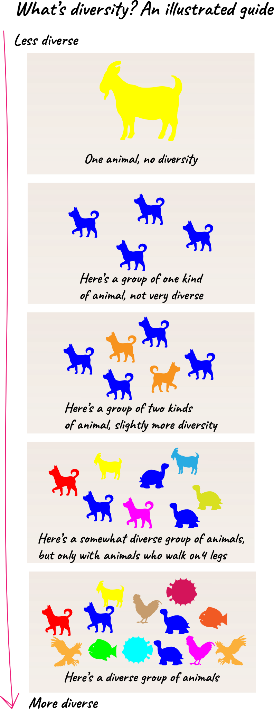
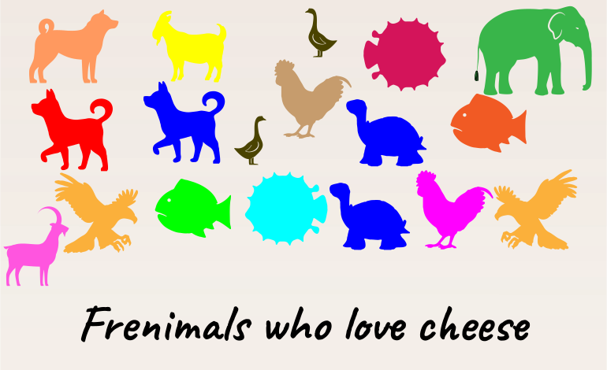

I'm publishing this post against my better judgement, and at the risk of starting a flamewar. However, I think it's time for a reality check for the "diversity and inclusion" crusaders.

First of all, let me make it perfectly clear that I'm very much in favour of diversity and including everyone regardless of their physical attributes. If you decide to judge me based on my skin tone or which chromosomes I was born with, that's on you.

## Why diversity is great

From a strictly genetic standpoint, diversity helps a species survive in the event of disease and adversity. Diversity is one way we develop special abilities and talents. Those abilities and talents can then be applied to solve problems in ways other people may have never considered. A diverse team can better understand the needs and preferences of large groups of people.

In some studies, diverse teams have been shown to perform better than non-diverse teams.

In the context of build a business, let me use an analogy: a group of all white sheep is probably not going to be the best team to design sweaters for chickens, no matter how good they are at making wool, because they don't know anything about chickens and their preferences.

## What is diversity?

To illustrate diversity, I have constructed a graphic illustration with the hope that it will anger as few people as possible.

## Doing it wrong

Let's take a look at [anti-discrimination laws in the US](https://en.wikipedia.org/wiki/Employment_discrimination_law_in_the_United_States) and treat it as a guideline for what doesn't count as "diversity and inclusion". Here are the attributes considered protected (i.e., don't discriminate against people for these). Here's a few:

- Race
- Sex
- National origin

I am _not_ a fan of the popular interpretation of "diversity" that is quite literally the opposite of diversity. You can see this everywhere by looking at organizations who beat the drum of "we love diversity" while simultaneously practicing in exclusion as a matter of policy. Let's call this _neodiversity_.

Examples of neodiversity include:

- Schools who only admit students of a particular type
- VCs that only invest in certain kinds of founders based on skin colour, nationality, or gender
- Conferences which only allow certain types of people for specific events (or perhaps the entire conference) especially in cases where it has nothing to do with the conference itself (e.g., tech conferences), based on their gender, skin colour, or whatever
- Companies with arbitrary hiring diversity goals strictly for the purpose of scoring PR ("we only hire 50/50 male/female software engineers because diversity!!!", whereas [86% of software engineers are male, according to one source](https://careersmart.org.uk/occupations/equality/which-jobs-do-men-and-women-do-occupational-breakdown-gender))

Neodiversity hurts everyone. It's the equivalent of building walls, constructing artifical barriers and it decreases cooperation amongst people. People fear criticizing neodiversity because they worry about retribution for speaking out, in spite of how idiotic it is.

In most cases, neodiversity is a big step backwards. I'll go as far to say that the people pushing this are actually _opposed_ to diversity and inclusion. They're merely hijacking those words to either spread their own anti-diversity cause (_my gender good, your gender bad_), or for cringeworthy PR purposes. In doing so they're merely feeding the culture wars.

## A better way to think about diversity and inclusion

It's a well known phenomenon that groups of people are more trusting, have more fun, and work harder together in groups with shared similarities. In the context of a business, employees are more likely to work hard and less likely to quit when they feel they're in a group of similar people.

There's a passage in the book "The Righteous Mind: Why Good People Are Divided by Politics and Religion" (pp. 276-277) as follows:

> [...] we can draw some direct lessons for anyone who wants to make a team, company, school, or other organization more hivish, happy, and productive. You don’t need to slip ecstasy into the watercooler and then throw a rave party in the cafeteria. The hive switch may be more of a slider switch than an on-off switch, and with a few institutional changes you can create environments that will nudge everyone’s sliders a bit closer to the hive position. For example:
> 
> - Increase similarity, not diversity. To make a human hive, you want to make everyone feel like a family. So don’t call attention to racial and ethnic differences; make them less relevant by ramping up similarity and celebrating the group’s shared values and common identity. A great deal of research in social psychology shows that people are warmer and more trusting toward people who look like them, dress like them, talk like them, or even just share their first name or birthday. There’s nothing special about race. You can make people care less about race by drowning race differences in a sea of similarities, shared goals, and mutual interdependencies.

## Celebrate similarities

Rather than focusing on differences, focus on similarities. Celebrate what makes people great. Celebrate shared valus, shared interests, and passion for doing great work. Celebrate people who are great people because of who they are, not how they look.

Please, for the love of cheese, stop trying to build more walls, more cultural divisions, and feeding the idiotic culture wars. It's not going to make your company look better, you just look like an ass.

Every person is quite literally [~99.6-99.9% identical to every other person on this planet](https://en.wikipedia.org/wiki/Human_genetic_variation) (depending on how you look at it), so let's focus on that.
