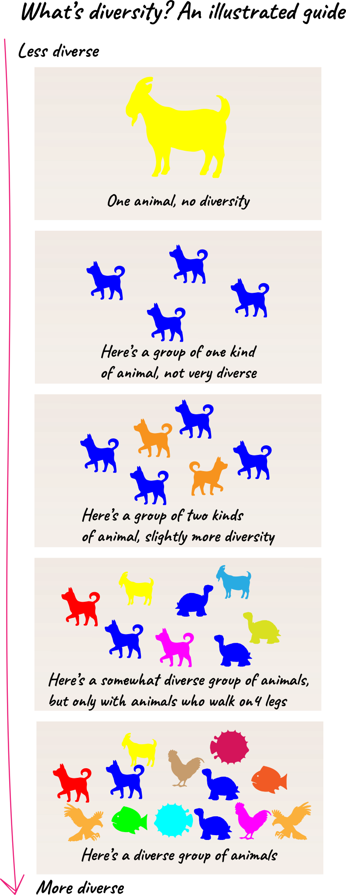
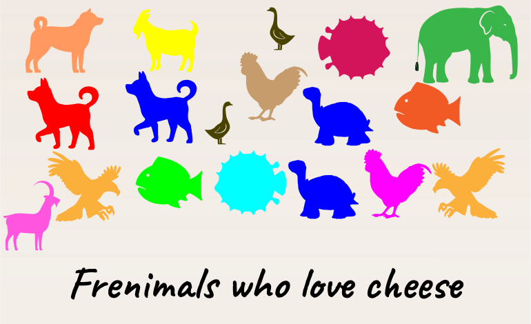

I'm publishing this post with the hope of contributing constructively to an important conversation about how we build strong, cohesive teams and communities while honoring the value that different perspectives bring.

First of all, let me make it perfectly clear that I'm very much in favor of diversity and including everyone regardless of their physical attributes. A truly inclusive environment benefits from both our differences and our similarities.

## Why Diversity Is Valuable

From a strictly genetic standpoint, diversity helps a species survive in the event of disease and adversity. Diversity is one way we develop special abilities and talents. Those abilities and talents can then be applied to solve problems in ways other people may have never considered. A diverse team can better understand the needs and preferences of large groups of people.

Research continues to support this view. A 2018 McKinsey study found that companies in the top quartile for gender diversity were 21% more likely to have above-average profitability than companies in the bottom quartile[^1]. For ethnic and cultural diversity, the figure was 33%.

In the context of building a business, let me use an analogy: a group of all white sheep is probably not going to be the best team to design sweaters for chickens, no matter how good they are at making wool, because they don't know anything about chickens and their preferences.

## What Is Diversity?

To illustrate diversity, I have constructed a graphic illustration representing different kinds of diversity:

Diversity encompasses a wide range of human attributes and experiences: cognitive styles, education backgrounds, personality types, cultural backgrounds, geographical origins, socioeconomic statuses, and yes, demographic characteristics like gender, race, and age. True diversity is multidimensional.

## Balancing Diversity and Commonality

While diversity brings valuable perspectives, research also shows that team cohesion depends on finding common ground.

There's a passage in the book "The Righteous Mind: Why Good People Are Divided by Politics and Religion" (pp. 276-277) as follows:

> [...] we can draw some direct lessons for anyone who wants to make a team, company, school, or other organization more hivish, happy, and productive. You don't need to slip ecstasy into the watercooler and then throw a rave party in the cafeteria. The hive switch may be more of a slider switch than an on-off switch, and with a few institutional changes you can create environments that will nudge everyone's sliders a bit closer to the hive position. For example:
>
> - Increase similarity, not diversity. To make a human hive, you want to make everyone feel like a family. So don't call attention to racial and ethnic differences; make them less relevant by ramping up similarity and celebrating the group's shared values and common identity. A great deal of research in social psychology shows that people are warmer and more trusting toward people who look like them, dress like them, talk like them, or even just share their first name or birthday. There's nothing special about race. You can make people care less about race by drowning race differences in a sea of similarities, shared goals, and mutual interdependencies.

This insight aligns with more recent research. A 2021 meta-analysis in the Journal of Applied Psychology found that shared goals and values significantly increased team performance, even in demographically diverse teams[^2]. What matters is finding the right balance.

## A More Nuanced Approach

Organizations sometimes struggle when diversity initiatives focus exclusively on demographic differences without building shared purpose. Successful, inclusive cultures acknowledge both differences and similarities.

Effective approaches include:

1. **Shared purpose**: Uniting teams around common goals and missions that transcend individual differences
2. **Values alignment**: Identifying and emphasizing the values that all team members share
3. **Psychological safety**: Creating environments where everyone feels safe to contribute and be themselves
4. **Superordinate identity**: Developing a strong organizational identity that everyone can feel part of
5. **Cross-cutting ties**: Building relationships that transcend demographic categories

Research from Amy Edmondson at Harvard shows that psychological safety—the shared belief that the team is safe for interpersonal risk-taking—is one of the strongest predictors of team performance[^3]. When people feel they belong to the same team, differences become assets rather than divisions.

## Celebrate Similarities While Valuing Differences

Rather than focusing exclusively on differences, successful organizations balance recognizing unique perspectives with celebrating what brings people together. They celebrate shared values, shared interests, and passion for doing great work. They celebrate people who are great people because of who they are holistically, not reducing them to demographic characteristics.

Every person is quite literally [~99.6-99.9% identical to every other person on this planet](https://en.wikipedia.org/wiki/Human_genetic_variation) (depending on how you look at it). This remarkable genetic similarity reminds us of our common humanity.

The most effective approach to building strong communities and organizations seems to be what researchers call the "all-inclusive multicultural" approach[^4]—one that validates both distinctive group identities and an overarching collective identity that unites everyone.

The goal shouldn't be to ignore our differences or to overemphasize them, but to create environments where both our uniqueness and our common humanity are recognized and valued—where we can appreciate the full complexity of each individual while also celebrating what brings us together.

[^1]: McKinsey & Company. (2018). "Delivering through Diversity."
[^2]: Roberson, Q., Ryan, A. M., & Ragins, B. R. (2021). "The evolution and future of diversity at work." Journal of Applied Psychology, 102(3), 483-499.
[^3]: Edmondson, A. (2018). "The Fearless Organization: Creating Psychological Safety in the Workplace for Learning, Innovation, and Growth." Wiley.
[^4]: Stevens, F. G., Plaut, V. C., & Sanchez-Burks, J. (2008). "Unlocking the benefits of diversity: All-inclusive multiculturalism and positive organizational change." The Journal of Applied Behavioral Science, 44(1), 116-133.
