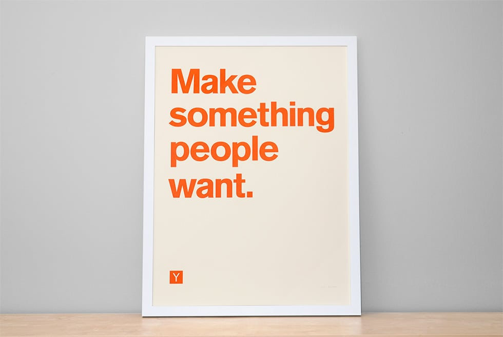

Y&nbsp;Combinator has a famous motto: _make something people want_. The first reference I could find to that motto was [this blog post from Paul Graham](http://www.paulgraham.com/good.html).

I think it's a great motto: people will pay for things they want, thus you can make a business out of it. But I can't help notice, most companies these days aren't being built for _people_, they're being built for companies. B2B businesses are easier because companies have lots of money to spend on things.

Additionally, some of the companies making things people want (e.g., Reddit) have turned to ads because you can get a lot more money out of companies running ads than you can out of ordinary people paying to use your product.

I looked quickly at the [top YC company list](https://www.ycombinator.com/topcompanies/) and did some analysis (using [HTTPie](https://httpie.org/), [pup](https://github.com/ericchiang/pup), [jq](https://github.com/stedolan/jq), and standard UNIX tools):

```console
$ http https://www.ycombinator.com/topcompanies/index.html | pup 'div[data-sectors] json{}' | jq '.[]."data-sectors"' | sort | uniq -c | sort -nr
  53 B2B Software and Services
  16 Financial Technology and Services
  11 Consumer Goods and Services
   4 Education
   3 Consumer Media
   3 Biotech
   3 Automotive
   2 Real Estate
   2 Healthcare
   2 Construction
   2 Aerospace
   1 Energy and Environment
```

Let's break it down (approximately):

* 13% of the companies appear to offer consumer products
* 87% of the companies are B2B and offer non-consumer products

<svg xmlns:xlink="http://www.w3.org/1999/xlink" version="1.1" style="font-family:'lucida grande', 'lucida sans unicode', arial, helvetica, sans-serif;font-size:16px; width:100%;" xmlns="http://www.w3.org/2000/svg" width="600" height="400" viewBox="0 0 600 400"><defs><linearGradient x1="0" y1="0" x2="0" y2="1" id="highcharts-38"><stop offset="0" stop-color="rgb(96,96,96)" stop-opacity="0.8"></stop><stop offset="1" stop-color="rgb(16,16,16)" stop-opacity="0.8"></stop></linearGradient><clipPath id="highcharts-39"><rect x="1" y="1" width="578" height="335"></rect></clipPath></defs><g class="highcharts-series-group"><g class="highcharts-series highcharts-series-0" transform="translate(10,10) scale(1 1)"><path fill="#cdb5b5" d="M 289.9709765684734 26.50000295564766 A 142.5 142.5 0 0 1 393.77869490353294 71.34636471631266 L 290 169 A 0 0 0 0 0 290 169 Z" stroke="#FFFFFF" stroke-width="1" stroke-linejoin="round" transform="translate(0,0)"></path><path fill="#18d225" d="M 393.8762966331979 71.45019222073333 A 142.5 142.5 0 1 1 289.8020703588248 26.500137460216678 L 290 169 A 0 0 0 1 0 290 169 Z" stroke="#FFFFFF" stroke-width="1" stroke-linejoin="round" transform="translate(0,0)"></path></g><g class="highcharts-markers highcharts-series-0" transform="translate(10,10) scale(1 1)"></g></g><g class="highcharts-data-labels highcharts-series-0" transform="translate(10,10) scale(1 1)" opacity="1"><path fill="none" d="M 363.50801113449967 10.187327069513266 C 358.50801113449967 10.187327069513266 355.33082800942145 17.52936407498511 350.96220121243886 27.624664957508905 L 346.59357441545626 37.7199658400327" stroke="#cdb5b5" stroke-width="1"></path><path fill="none" d="M 216.4919888655004 326.81267293048677 C 221.4919888655004 326.81267293048677 224.6691719905786 319.47063592501496 229.0377987875612 309.37533504249114 L 233.4064255845438 299.28003415996733" stroke="#18d225" stroke-width="1"></path><g style="cursor:pointer;" transform="translate(369,0)"><text x="5" class="fill-black dark:fill-white" style="text-rendering: geometricprecision; text-shadow: none;" y="15"><tspan>Something people want: 13%</tspan></text></g><g style="cursor:pointer;" transform="translate(-10,317)"><text x="0" class="fill-black dark:fill-white" style="text-rendering: geometricprecision; text-shadow: none;" y="15"><tspan>Something companies want: 87%</tspan></text></g></g></svg>

-----------

## Making What People Want

I was having a conversation with a friend recently about the type of companies that attract VC funding nowadays, and both of us felt that the majority of new companies aren't building interesting products. Most new companies are merely optimizing business tools or problems. Very, very few of these companies are actually creating new technology that affect people's lives directly.

Additionally, it's really hard to attract VC interest for businesses that fall outside the typical B2B mold. Building a technology business that's wildly different, with a mission to improve people's lives, is _very_ hard, and nearly impossible if you can't attract funding.

I can't help but ask the question: when was the last time anyone got excited about B2B products? I, for one, don't get excited about most B2B product offerings.

## The B2B Reality

To be fair, there are legitimate reasons why B2B dominates the startup landscape:

1. **Clear path to revenue**: B2B companies often have a more straightforward path to generating revenue. Companies are willing to pay for tools that increase efficiency or reduce costs.

2. **Higher margins**: B2B products typically command higher prices and better margins than consumer products, making them more attractive to investors.

3. **Lower customer acquisition costs**: Acquiring business customers can be more efficient than acquiring thousands or millions of consumers.

4. **Predictable growth**: Enterprise sales cycles might be longer, but they often lead to more predictable, subscription-based revenue models that VCs love.

5. **Indirect consumer impact**: Many B2B companies do ultimately impact consumers, just indirectly. Think about how Stripe has made online payments easier, or how cloud infrastructure companies enable consumer-facing applications.

## The Innovation Gap

Still, there's something missing in the current startup ecosystem. When we look at the technologies that have truly transformed how people live—the internet, smartphones, social networks, search engines—these were fundamentally consumer-oriented innovations, even if they eventually developed complex business models.

The problem isn't that B2B startups are bad—many are solving real, important problems. The problem is that the overwhelming focus on B2B may be creating an innovation gap where ambitious, consumer-focused technologies struggle to get off the ground.

This matters because true technological revolutions often start with seemingly impractical ideas that directly touch people's lives. The internet wasn't created to optimize corporate workflows; it was built to connect people and information. The same is true for personal computers, smartphones, and many other transformative technologies.

## Finding a Balance

What would a more balanced innovation ecosystem look like? Perhaps it would include:

* **Patient capital** for consumer-focused startups that might take longer to monetize but could have massive impact
* **More emphasis on direct consumer needs** rather than just enterprise efficiency
* **Creative business models** that can sustain consumer products without resorting to invasive advertising
* **Recognition that "people" includes everyone**, not just business users

Some of the most interesting startups today are finding ways to build for consumers while creating sustainable business models. Think about companies like Notion, which started with a focus on individual users before expanding to teams and enterprises.

## A More Nuanced Motto

YC might want to update their motto to _make something companies want_. It's easier to build a boring B2B business than it is to make something cool and interesting.

But perhaps a better update would be: _make something people truly need—whether those people are consumers or businesses_. The key is to focus on creating genuine value, solving real problems, and building products that improve lives—directly or indirectly.

The reality is that both consumer and business innovations are valuable. We need entrepreneurs working on both fronts. But in an ecosystem that's increasingly tilted toward B2B, there's a case to be made for rebalancing our collective focus and remembering that the most transformative technologies often start by directly addressing human needs and desires.

So while "make something people want" remains a great motto, perhaps we should add: "and remember that 'people' doesn't just mean businesses."
