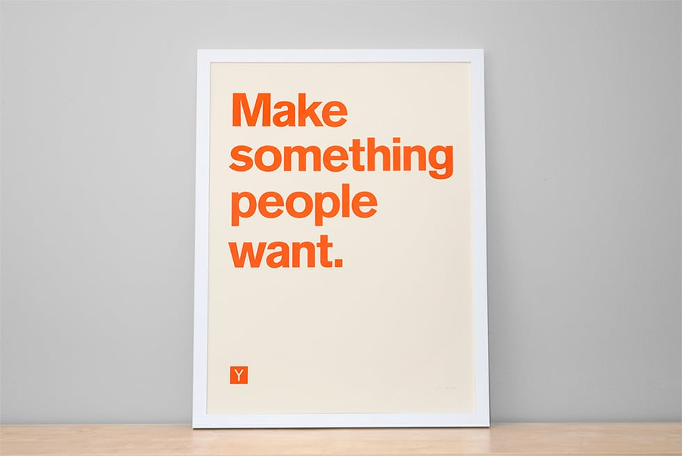

Y Combinator's guiding philosophy—captured in their motto "make something people want"—has influenced countless entrepreneurs since its first appearance in [Paul Graham's blog post](http://www.paulgraham.com/good.html) on startup fundamentals.

This principle elegantly distills a core truth of value creation: develop products that address genuine needs, and sustainable business opportunities naturally follow. However, examining the current landscape of high-growth technology companies reveals an interesting pattern in how this philosophy manifests in practice.

## The Business-to-Business Emphasis

A notable trend in contemporary startup ecosystems is the predominance of solutions developed primarily for organizational rather than individual consumers. Business-to-business (B2B) ventures often present more straightforward paths to revenue, as enterprises typically command larger budgets for solving operational challenges than individual consumers allocate for personal products.

Similarly, platforms initially designed around consumer experiences (such as Reddit) frequently evolve toward advertising-based models, recognizing that monetizing business marketing budgets can generate substantially higher revenue than direct consumer payments.

To quantify this observation, I conducted a brief analysis of Y Combinator's [top companies](https://www.ycombinator.com/topcompanies/) using data processing tools ([HTTPie](https://httpie.org/), [pup](https://github.com/ericchiang/pup), [jq](https://github.com/stedolan/jq), and standard UNIX utilities):

```console
$ http https://www.ycombinator.com/topcompanies/index.html | pup 'div[data-sectors] json{}' | jq '.[]."data-sectors"' | sort | uniq -c | sort -nr
  53 B2B Software and Services
  16 Financial Technology and Services
  11 Consumer Goods and Services
   4 Education
   3 Consumer Media
   3 Biotech
   3 Automotive
   2 Real Estate
   2 Healthcare
   2 Construction
   2 Aerospace
   1 Energy and Environment
```

When categorized by market focus:

* Approximately 13% develop primarily consumer-oriented products
* Approximately 87% concentrate on business-to-business solutions

<svg xmlns:xlink="http://www.w3.org/1999/xlink" version="1.1" style="font-family:'lucida grande', 'lucida sans unicode', arial, helvetica, sans-serif;font-size:16px; width:100%;" xmlns="http://www.w3.org/2000/svg" width="600" height="400" viewBox="0 0 600 400"><defs><linearGradient x1="0" y1="0" x2="0" y2="1" id="highcharts-38"><stop offset="0" stop-color="rgb(96,96,96)" stop-opacity="0.8"></stop><stop offset="1" stop-color="rgb(16,16,16)" stop-opacity="0.8"></stop></linearGradient><clipPath id="highcharts-39"><rect x="1" y="1" width="578" height="335"></rect></clipPath></defs><g class="highcharts-series-group"><g class="highcharts-series highcharts-series-0" transform="translate(10,10) scale(1 1)"><path fill="#cdb5b5" d="M 289.9709765684734 26.50000295564766 A 142.5 142.5 0 0 1 393.77869490353294 71.34636471631266 L 290 169 A 0 0 0 0 0 290 169 Z" stroke="#FFFFFF" stroke-width="1" stroke-linejoin="round" transform="translate(0,0)"></path><path fill="#18d225" d="M 393.8762966331979 71.45019222073333 A 142.5 142.5 0 1 1 289.8020703588248 26.500137460216678 L 290 169 A 0 0 0 1 0 290 169 Z" stroke="#FFFFFF" stroke-width="1" stroke-linejoin="round" transform="translate(0,0)"></path></g><g class="highcharts-markers highcharts-series-0" transform="translate(10,10) scale(1 1)"></g></g><g class="highcharts-data-labels highcharts-series-0" transform="translate(10,10) scale(1 1)" opacity="1"><path fill="none" d="M 363.50801113449967 10.187327069513266 C 358.50801113449967 10.187327069513266 355.33082800942145 17.52936407498511 350.96220121243886 27.624664957508905 L 346.59357441545626 37.7199658400327" stroke="#cdb5b5" stroke-width="1"></path><path fill="none" d="M 216.4919888655004 326.81267293048677 C 221.4919888655004 326.81267293048677 224.6691719905786 319.47063592501496 229.0377987875612 309.37533504249114 L 233.4064255845438 299.28003415996733" stroke="#18d225" stroke-width="1"></path><g style="cursor:pointer;" transform="translate(369,0)"><text x="5" class="fill-black dark:fill-white" style="text-rendering: geometricprecision; text-shadow: none;" y="15"><tspan>Something people want: 13%</tspan></text></g><g style="cursor:pointer;" transform="translate(-10,317)"><text x="0" class="fill-black dark:fill-white" style="text-rendering: geometricprecision; text-shadow: none;" y="15"><tspan>Something companies want: 87%</tspan></text></g></g></svg>

## The Consumer Innovation Opportunity

In conversations with colleagues about venture capital priorities, we've observed that many emerging companies focus primarily on optimizing existing business processes rather than pioneering transformative consumer experiences. This emphasis on incremental business optimization, while economically rational, may leave significant opportunities for consumer-focused innovation underexplored.

The funding landscape presents additional challenges for ventures operating outside conventional B2B models. Developing consumer technology with profound impact potential often requires substantial capital commitment before demonstrating traditional revenue metrics, creating unique hurdles for securing investment.

This dynamic raises an interesting question about emotional engagement with technology: when did you last experience genuine excitement about a B2B offering? While enterprise solutions deliver crucial value through efficiency and optimization, they rarely generate the visceral enthusiasm that compelling consumer innovations inspire.

## Evolving Interpretations

Perhaps the startup landscape would benefit from reconsidering how we interpret foundational principles like "make something people want." While the current emphasis on B2B solutions represents a pragmatic approach to business building, unexplored opportunities may exist for ventures bold enough to develop products that spark genuine human excitement and address fundamental consumer needs.

The path toward consumer-focused innovation may present greater challenges in securing investment and demonstrating early revenue, but it also offers potential for creating solutions with profound and direct human impact.