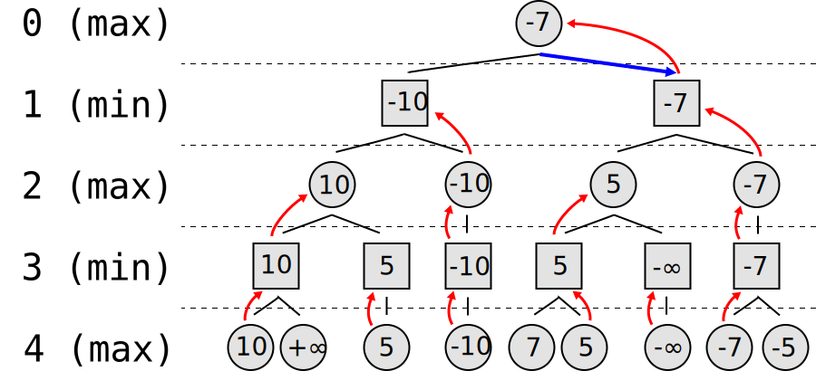

Prediction represents one of the most fascinating aspects of human cognition—our attempt to anticipate future developments based on incomplete information. Throughout my experience with forecasting across various domains, I've developed a deep appreciation for both the value and the limitations of predictive thinking.

## The Prediction Landscape: Successes and Challenges

My forecasting journey includes both successful predictions and notable misses. Among the more accurate assessments were recognizing the transformative potential of software and internet technologies since the 1990s, identifying the market opportunity represented by Airbnb, and appreciating Bitcoin's disruptive potential. However, even with these successful predictions, timing proved challenging—particularly with cryptocurrency investments where directional accuracy didn't always translate to optimal entry and exit points.

In terms of predictions that didn't materialize as anticipated, several examples stand out. I underestimated the Federal Reserve's commitment to interest rate increases, predicting that rates wouldn't exceed 0.50% by the end of 2022—a projection that market developments quickly surpassed.

Another ongoing prediction involves digital advertising economics. Despite compelling evidence from researchers, including a notable [Freakonomics two-part series](https://freakonomics.com/podcast/does-advertising-actually-work-part-1-tv-ep-440/) examining advertising efficacy, the anticipated adjustment in digital advertising valuations hasn't materialized as expected. The competitive dynamics of advertising—where companies continually vie for consumer attention—appears to sustain the market even amid questions about measurement and effectiveness.

Political forecasting presents its own unique challenges. Following the 2008 election, I anticipated significant policy shifts that would fully realize campaign promises. While notable achievements occurred—including healthcare reforms that eliminated exclusions for pre-existing conditions—the implementation proved more measured and incremental than initially anticipated.

The COVID-19 pandemic offered perhaps the most profound forecasting lesson. My initial assessment suggested it might represent a transient news cycle rather than a transformative global event. This perspective was quickly revised as the pandemic's far-reaching impacts became apparent. Media coverage has evolved accordingly, with the New York Times gradually adjusting the prominence of their coronavirus tracker as the pandemic has moved through different phases.

The evolution of this coverage reflects shifting public attention, though it's worth noting that other significant public health challenges—from chronic disease to environmental health impacts—receive comparatively less consistent visibility despite their substantial societal impact.

## Prediction vs. Implementation: The Complete Decision Process

Perhaps the most valuable insight from these experiences is recognizing that accurate prediction, while important, represents only one component of effective decision-making. The implementation strategy—how one acts on predictive insights—often determines ultimate outcomes. When considering market-based decisions specifically, timing and position sizing frequently account for approximately 90% of investment results.

Constructing appropriate strategies to capitalize on predictive insights presents significant complexity. Consider the challenge of positioning for potential challenges at a major technology company. While establishing a short position might seem straightforward, several nuanced factors complicate this approach:

- Well-recognized trends typically become reflected in asset prices before individual investors can capitalize on them
- Market efficiency means professional analysts have often incorporated widely-discussed scenarios into current valuations
- Standard investment tools available to retail investors may not offer favorable risk-reward characteristics once market expectations are priced in
- The time horizon for predictions to materialize can exceed the practical holding period for certain investment strategies

As John Maynard Keynes famously observed, "Markets can remain irrational longer than you can remain solvent."

Sophisticated investors often address these challenges through carefully structured positions that mitigate specific risks. Rather than simple directional bets, they might employ relative value strategies that pair related assets, utilize specialized derivatives, or construct positions that limit carrying costs. For example, the cost to borrow shares for short selling—currently 9.6% for certain volatile stocks—creates a significant hurdle rate that any potential price decline must overcome to generate positive returns.

## Strategic Risk Management: The Minimax Approach

<figure class="sm:max-w-[16rem] sm:float-right sm:mr-0 sm:ml-4 my-1">
  
  <figcaption>Minimax decision tree representation from Wikipedia</figcaption>
</figure>

These practical challenges highlight the relevance of game theory concepts to prediction-based decision-making. The [minimax principle](https://en.wikipedia.org/wiki/Minimax)—minimizing the maximum possible loss—offers a particularly valuable framework. Rather than maximizing potential gains in isolation, this approach prioritizes protecting against downside scenarios while pursuing opportunities.

This principle connects to the broader concept of [Nash equilibrium](https://en.wikipedia.org/wiki/Nash_equilibrium), popularized in ["A Beautiful Mind"](https://en.wikipedia.org/wiki/A_Beautiful_Mind_(book)), which explores how optimal outcomes often emerge when participants act in ways that balance individual and collective interests. Similar dynamics appear in the classic [prisoner's dilemma](https://en.wikipedia.org/wiki/Prisoner%27s_dilemma), where mutual cooperation frequently produces superior outcomes compared to purely self-interested choices.

When implementing prediction-based strategies, focusing exclusively on maximum potential returns (a "maximax" approach) often increases vulnerability to extreme negative outcomes. While occasionally generating spectacular results, this approach typically underperforms more balanced strategies over extended periods due to its asymmetric risk profile.

## Practical Applications in Investment Strategy

An alternative framework involves using predictions primarily for risk management rather than speculative positioning. [Modern Portfolio Theory](https://en.wikipedia.org/wiki/Modern_portfolio_theory) exemplifies this approach by diversifying across assets with different response patterns to economic conditions. This strategy aims to create resilience rather than maximize returns in specific scenarios.

However, even diversification strategies face limitations during periods of market stress when previously uncorrelated assets begin moving in tandem—a phenomenon increasingly observed in contemporary financial markets as monetary policy shifts affect multiple asset classes simultaneously.

The most valuable approach to prediction may ultimately involve maintaining a balanced perspective—recognizing both the importance of anticipating future developments and the inherent limitations of forecasting in complex adaptive systems. By combining thoughtful prediction with prudent implementation strategies, we can navigate uncertainty more effectively while remaining adaptable to emerging information and changing circumstances.