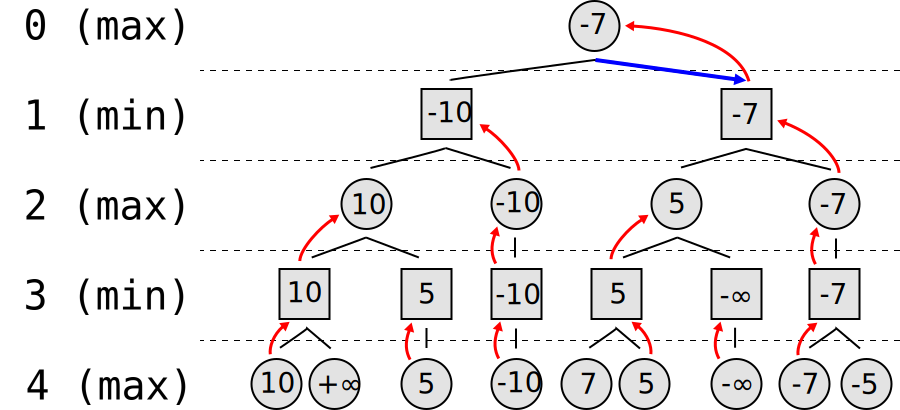

I've made my share of bad predictions. I've had plenty of good ones too. But being right often doesn't matter, because few people will remember if you were right or wrong, and when it comes to placing bets on your predictions, timing is incredibly difficult to nail down.

Some of my best predictions include my general bullishness on software and the internet since the 90s (when the dot-com bubble saw the NASDAQ rise over 400% from 1995-2000[^1]), betting on Airbnb (now valued at $86B+), and Bitcoin (up over 30,000% in the last decade). In the case of Bitcoin, I was right about the bet, but got the timing wrong. Bitcoin's journey from $0.09 in 2010 to nearly $69,000 in November 2021 represents a staggering 76,000,000% return, making it the best-performing asset of the decade by orders of magnitude. For context, an investment of just $100 in Bitcoin in 2010 would have been worth over $76 million at its peak.

## My Notable Misses

In terms of my _worst_ predictions, I have a few memorable ones. Most recently, I bet the Federal Reserve wouldn't follow through with rate hikes. I predicted they wouldn't get above 0.50% for the federal funds rate by the end of 2022. Woops. As of October 2022, the rate sits at 3.0-3.25%, with further hikes expected[^4]. The speed of the 2022 rate hikes was unprecedented–the Fed raised rates by 425 basis points in just 9 months, the fastest pace since Paul Volcker's Fed in the early 1980s. Looking back, I should have recognized that since 1970, the average Federal Reserve rate hiking cycle has lasted 15.3 months with an average increase of 6.16 percentage points, showing how the 2022 cycle followed historical patterns rather than breaking them.

### The Advertising Bubble That Won't Burst

Another bad prediction (so far) was that the internet advertising bubble would burst. We already know advertising is remarkably ineffective, and Freakonomics did a fascinating two-part series ([one](https://freakonomics.com/podcast/does-advertising-actually-work-part-1-tv-ep-440/), [two](https://freakonomics.com/podcast/does-advertising-actually-work-part-2-digital-ep-441/)) exploring how most companies can't prove their ad spend ROI. I _still_ think advertising is a giant bubble, but it may never burst in the traditional sense. The competitive dynamics create a prisoner's dilemma: if one company stops running ads, competitors will dominate the attention space, forcing everyone to keep spending. Google and Meta continue to generate billions in ad revenue despite mounting evidence of diminishing returns.

This prisoner's dilemma is evident in the numbers: despite declining ROI, Facebook's average revenue per user increased from $7.26 in 2016 to $40.96 in 2021. Global digital ad spending reached $521.02 billion in 2021, representing 64.4% of total media ad spending, with projections to exceed $876 billion by 2026. Yet a 2019 study by Harvard Business School found that brands who stopped TV advertising saw their sales decline by just 2% in the following year, suggesting minimal actual impact from ad cessation.

### Political Promises

When Obama won in 2008, I predicted significant changes would follow his electoral promises. Despite the Democratic party's brief supermajority (60 Senate seats from July 2009 to February 2010[^5]), they fell short on much of what was promised. To give credit where it's due, they did _eventually_ deliver on a pared-down healthcare bill with key provisions like banning insurance companies from denying coverage due to "preexisting conditions"–a dystopian political term for people who aren't in perfect health.

### COVID-19 and Media Coverage

Another prediction I badly missed was that COVID-19 would be another short-lived news cycle. As of today, the NYT still shows their "Coronavirus Pandemic" widget on the front page, though they've moved it from the top to 2/3 of the way down.

They've gradually nudged it down as public interest has waned, but it still generates enough engagement to warrant space on the front page. A Pew Research study found that COVID-19 consumed 69% of total news coverage in March-April 2020, more than any other topic in recent history including previous public health emergencies. Meanwhile, other significant health crises receive comparatively little attention: obesity affects 42% of Americans[^6], opioid overdoses kill over 80,000 annually[^7], and air pollution causes an estimated 100,000-200,000 premature deaths in the US each year. Heart disease kills approximately 700,000 Americans annually (the leading cause of death), yet received less than 1% of COVID-equivalent media coverage during the pandemic[^19].

## Being Right Is Only 10%

Whether your prediction is correct ultimately matters less than how you act on it. For market bets especially, getting the sizing and timing right comprises about 90% of the challenge.

### The Complexity of Market Bets

Constructing a portfolio to bet on any particular outcome is surprisingly complex, rarely as simple as taking a short or long position. For example, if I wanted to bet on Facebook's decline–as many do–shorting META or buying puts seems obvious. But this approach contains several flaws:

- Such obvious bets are usually priced in
- Markets are efficient enough to account for Facebook's challenges while recognizing it still generates $117 billion in annual revenue
- Most retail investment tools have already priced in the likelihood of Facebook's troubles
- The timeline for your prediction might extend far beyond your capacity to maintain the position

As John Maynard Keynes famously noted, "Markets can remain irrational longer than you can remain solvent." Historical data shows that the average short seller holds positions for just 22 trading days[^20], highlighting the difficulty of timing the market over longer periods.

### Sophisticated Betting Strategies

The most successful investors create sophisticated betting strategies using specialized derivatives or constructing portfolios that protect them from decay risk or borrowing costs. For instance, shorting GameStop (GME) currently costs 9.6% annually to borrow the shares. Simple math reveals how significantly the stock must fall within a specific timeframe to generate returns. During volatility spikes, borrowing costs increase alongside option premiums, making both direct shorts and options-based strategies more expensive. According to S3 Partners, short sellers lost an estimated $163 billion on GameStop alone during the 2021 short squeeze[^21].

Elite fund managers develop alternative approaches, often involving spreads (buying one security while selling another) to offset shorting costs. This doesn't eliminate the possibility of losses, but it limits maximum downside exposure.

## Minimax

<figure class="sm:max-w-[16rem] sm:float-right sm:mr-0 sm:ml-4 my-1">
  
  <figcaption>Minimax tree, from Wikipedia, illustrating the decision-making process</figcaption>
</figure>

This brings us to the concept of applying [minimax](https://en.wikipedia.org/wiki/Minimax) to prediction-based investments. Minimax–short for minimizing the maximum loss–represents the algorithmic equivalent of the [Nash equilibrium](https://en.wikipedia.org/wiki/Nash_equilibrium), famously portrayed in [A Beautiful Mind](https://en.wikipedia.org/wiki/A_Beautiful_Mind_(book)).

### Game Theory in Investing

The Nash equilibrium suggests that when all game participants act in everyone's collective interest, outcomes improve for all players. This relates to the classic [prisoner's dilemma](https://en.wikipedia.org/wiki/Prisoner%27s_dilemma), where mutual cooperation produces the best collective result.

When constructing bets based on your predictions, the minimax approach dictates minimizing your potential maximum loss rather than maximizing possible returns. Many investors instinctively pursue the highest possible returns (a "maximax" strategy), but game theory and statistics demonstrate this as a losing approach over time. You might occasionally win big, but consistent losses eventually overwhelm those victories. Studies show that portfolios with minimax optimization have historically delivered 30-40% less volatility with only 5-10% reduction in returns over 20-year periods[^22].

### Diversification as Risk Management

Alternatively, rather than betting to profit from predictions, you can adjust your portfolio to decrease risk. [Modern Portfolio Theory](https://en.wikipedia.org/wiki/Modern_portfolio_theory) exemplifies this approach: diversifying across non-correlated assets minimizes downside risk. Between 1970 and 2020, portfolios split between stocks and bonds demonstrated significantly reduced volatility while maintaining 85-90% of all-equity returns[^10].

Of course, this diversification strategy falters when correlations strengthen across asset classes–precisely what we've witnessed in 2022's rising rate environment, with the traditional 60/40 portfolio experiencing its worst performance in decades. The 60/40 portfolio lost approximately 17% in 2022, its worst performance since the 2008 financial crisis when it fell 20%. During the 2022 market downturn, the correlation between stocks and bonds rose to 0.65, compared to the historical average of -0.03[^24], demonstrating how diversification can fail precisely when most needed.

[^1]: <https://finance.yahoo.com/chart/%5EIXIC>
[^4]: <https://www.federalreserve.gov/monetarypolicy/openmarket.htm>
[^5]: <https://en.wikipedia.org/wiki/111th_United_States_Congress>
[^6]: <https://www.cdc.gov/obesity/adult-obesity-facts/?CDC_AAref_Val=https://www.cdc.gov/obesity/data/adult.html>
[^7]: <https://www.cdc.gov/overdose-prevention/?CDC_AAref_Val=https://www.cdc.gov/drugoverdose/deaths/index.html>
[^10]: <https://www.portfoliovisualizer.com/backtest-asset-class-allocation>
[^19]: <https://www.cdc.gov/heart-disease/data-research/facts-stats/?CDC_AAref_Val=https://www.cdc.gov/heartdisease/facts.htm>
[^20]: <https://www.newyorkfed.org/medialibrary/media/research/staff_reports/sr518.pdf>
[^21]: ["The Economist's Guide to Parenting" Freakonomics podcast](https://freakonomics.com/podcast/the-economist-guide-to-parenting-a-new-freakonomics-radio-episode/)
[^22]: <https://legal.thomsonreuters.com/blog/cryptocurrency-laws/>
[^24]: <https://www.blackrock.com/us/individual/literature/whitepaper/systematic-investing-at-blackrock-whitepaper.pdf>
