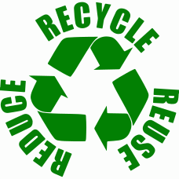

Recycling has become a bit of a crutch these days. It's a way for people to feel good about what they're doing ("saving the planet") without changing their behaviour. It gives people a free pass on generating waste; it allows them to save face.

Recycling is one of those things that sounds good on the surface, but ends up having unintended consequences which may in fact be _worse_ than the alternative.

Recycling has a lot of issues:

- in some cases the actual process of recycling can use more energy than it saves (although this is often disputed), especially in cases where recycled material is being [shipped around the world](https://en.wikipedia.org/wiki/Canada%E2%80%93Philippines_waste_dispute) so that it can be [dumped on someone else](https://www.theguardian.com/us-news/2019/jun/17/recycled-plastic-america-global-crisis)
- often the material sent for recycling is [never recycled at all](https://archive.is/8kLAg)
- costs have—in some cases—[become unsustainable](https://archive.is/uYPjQ) and numerous US cities have [ended or scaled down recycling programs](https://www.wastedive.com/news/what-chinese-import-policies-mean-for-all-50-states/510751/)
- some believe that recycling is [coming to an end altogether](https://fivethirtyeight.com/features/the-era-of-easy-recycling-may-be-coming-to-an-end/), which suggests we need to find a better way to manage waste

However, recycling does have some benefits. [According to the EPA](https://www.epa.gov/facts-and-figures-about-materials-waste-and-recycling/national-overview-facts-and-figures-materials):

> In 2017, the recycling, composting, combustion with energy recovery and landfilling of MSW saved over 184 million metric tons of carbon dioxide equivalent (MMTCO2E). This is **comparable to the emissions that could be reduced from taking over 39 million cars off the road in a year**.

## Re-thinking waste

The main issue with recycling is (and always has been) that it doesn't get at the root of the cause: waste generation. Recycling may have it's benefits, but it does nothing to discourage people from generating waste in the first place.

The biggest driver of waste is consumerism and [throwaway culture](https://en.wikipedia.org/wiki/Throw-away_society). It's difficult to [repair consumer products](https://en.wikipedia.org/wiki/Electronics_right_to_repair), they [aren't build to last](https://en.wikipedia.org/wiki/Planned_obsolescence), and we're constantly being bombarded with ads telling us to buy more and use our brains less.

## Reduce

The best thing people can do is focus on reducing consumption, which is at the top of the _reduce -> reuse -> recycle_ funnel. Consumption reduction also has a number of knock-on benefits, such as making you a wealthier person and limiting the number of problems you have to deal with in life. Strategies to reduce consumption include:

- purchasing higher quality goods which are meant to last, rather than be replaced
- avoiding trendy items (like fashionable clothing), which make up a [significant proportion of waste](https://www.epa.gov/facts-and-figures-about-materials-waste-and-recycling/textiles-material-specific-data)—I, for one, pretty much wear the same clothes every day and nobody has ever had an issue with it
- living in smaller homes to discourage filling them with junk and furniture that you don't need
- living in smaller homes to reduce the amount of material needed and wasted for the home itself (also, there's reduced heating, cooling, and lighting costs)
- living in cities that offer lots of transport options such that you don't need to purchase automobiles (which are a massive source of waste: even though about [10 million cars are recycled per year](https://en.wikipedia.org/wiki/Vehicle_recycling), [more cars are being sold](https://en.wikipedia.org/wiki/Passenger_vehicles_in_the_United_States#Sales) which means there's a lot of waste)
- living as close as possible to your workplace to reduce wear and tear on disposable items

Plus, if you think you feel smug about how good you are at recycling, you'll be excited to know how _absolutely amazing_ you'll feel when you go around telling everyone about how little waste you're generating.
